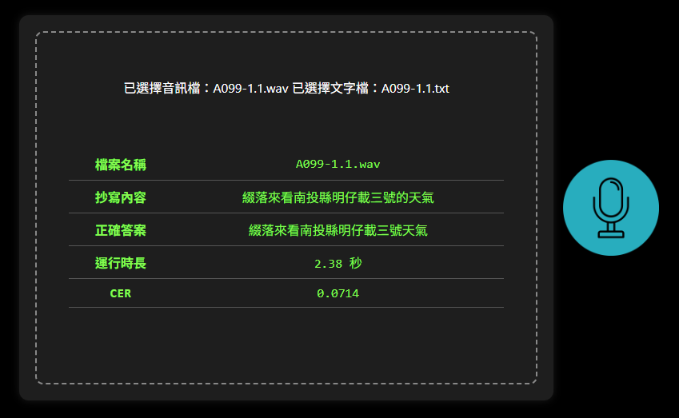

# 🗣️ ASR-API Server

## 🚀 功能特色

- ✅ 提供 `/v1/transcription` 語音抄寫 API
- ✅ 支援 Docker Compose 開發與部署
- ✅ 可即時掛載程式目錄，方便本地開發
- ✅ CER 分數比對計算
- ✅ 支援麥克風 / 音檔上傳

## 更新項目
- 05/21 新增音檔上傳UI

## 🧱 專案結構

```
.
rezolve-fastapi/
│
├── docker-compose.yml
│
├── asr/
│   ├── app/
│   │   ├── static/
│   │   |   ├── index.html
│   │   |   └── mic.png
│   │   ├── main_asr.py
│   │   └── whisper_handler.py # asr模型載入 (faster-whisper 格式)
│   │
│   ├── models/                # 用來儲存 ASR 模型檔案
│   │   └── <model_files>      # 包含config.json / model.bin / vocabulary.json
│   │
│   └── Dockerfile
├── README.md
├── xxx.txt
└── xxx.wav
```

## ⚙️ 安裝與執行

### 🔧 1. 安裝 Docker 與 Docker Compose

請先安裝 Docker 與 docker-compose：

- [Docker 官方下載](https://www.docker.com/products/docker-desktop/)

### ▶️ 2. 啟動服務

```bash
docker compose up --build
port :
- asr-server: 10000

localhost:10000 開啟
```


## 📡 API 使用方式

### ASR: POST `/audio/transcriptions`

#### 請求參數（`multipart/form-data`）

| 欄位名稱 | 類型        | 說明                       |
|----------|-------------|----------------------------|
| `file`   | `UploadFile`| 音訊檔案（必填）           |
| `model`  | `str`       | 模型名稱（預設為 `whisper-1`）  |
| `answer_file`  | `UploadFile`       | txt檔案(裡面為正確答案)  |


---

#### 🧪 測試範例

```bash
curl -X POST http://localhost:10000/v1/audio/transcriptions \
  -F "file=@A099-1.1.wav" \
  -F "model=whisper-1" \
  -F "answer_file=@A099-1.1.txt"
```

---

#### 回傳答案
```bash
{"檔案名稱":"A099-1.1.wav","抄寫內容":"綴落來看南投縣明仔載三號的天氣","正確答案":"綴落來看南投縣明仔載三號天氣","運行時長":"1.87 秒","CER":0.0714}
```

#### UI範例

